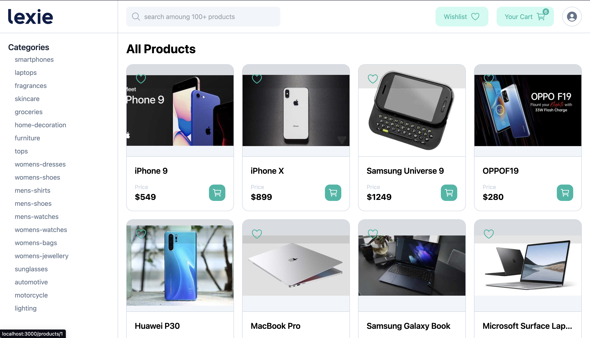
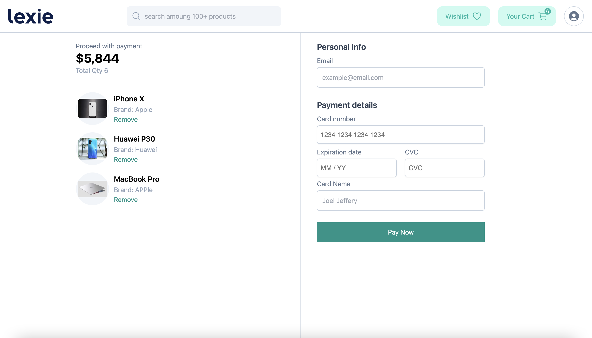
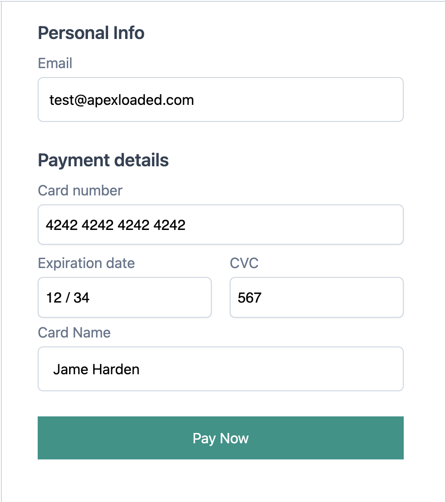

## Lexie-ai Mini store
<p align="left">

</p>
<p align="left">

</p>

This project was built using [dummyjson.com](https://dummyjson.com/) API, all products and categories are been fetched from the API.

## Live Demo
Kindly visit [lexie](https://lexie.vercel.app) for a live demo of this app

### Test Card info
<p align="left">

</p>

## Features
- React Redux (Cart) Start managment
- Stripe payment integration

## Getting Started

Clone Lexie-ai Mini store
```bash
git clone https://github.com/Apexloaded/lexie.git
```

Install Add dependencies
```bash
npm i
```

### Thank You